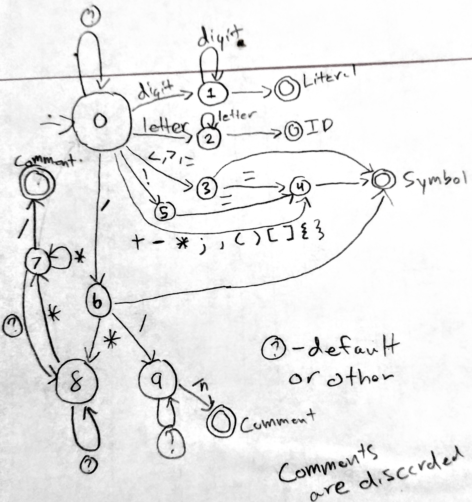
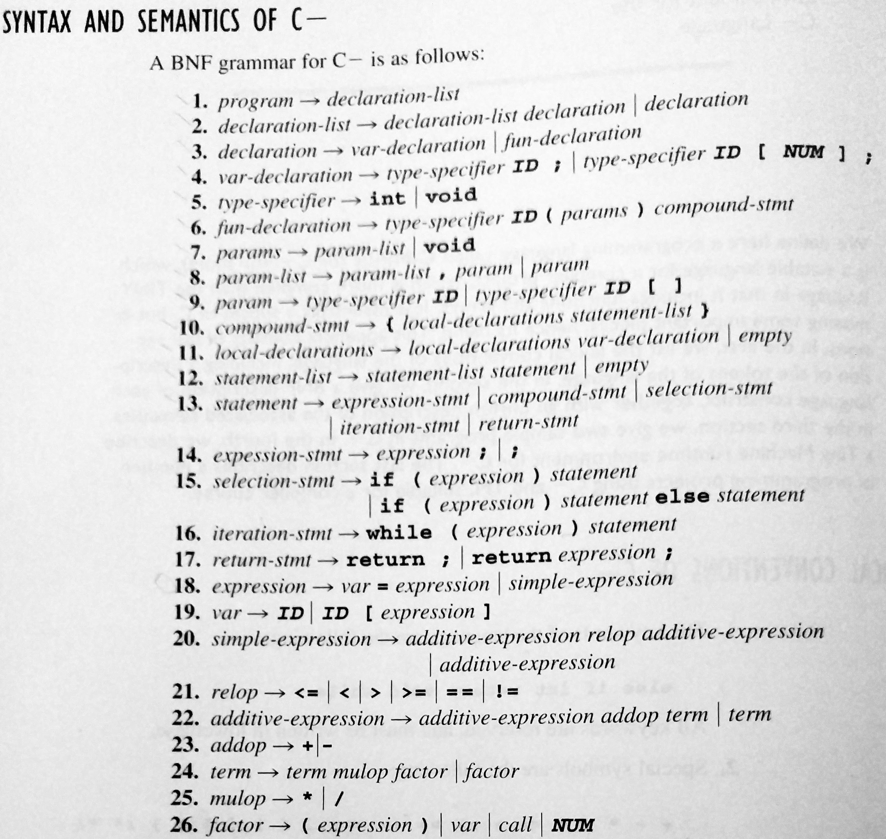
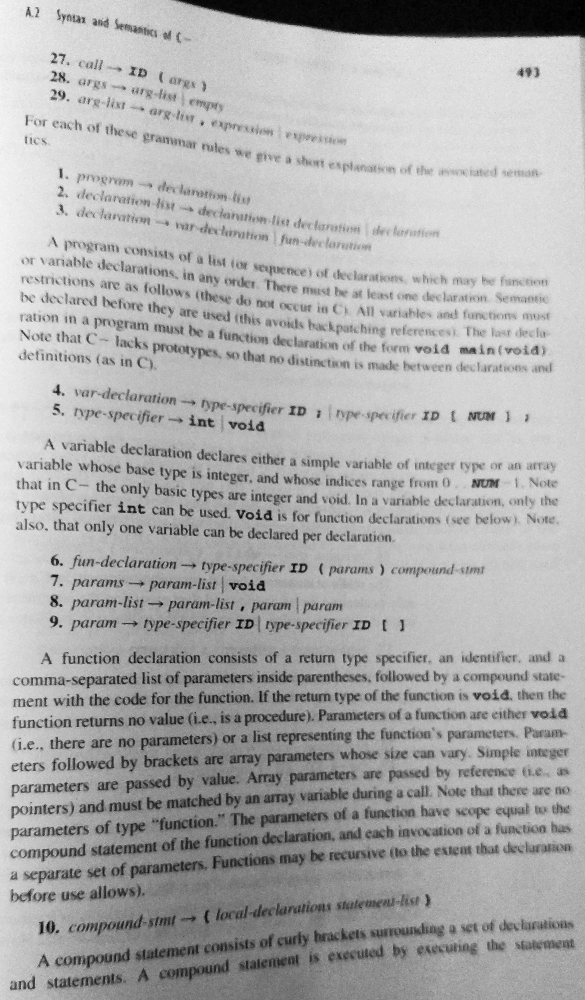
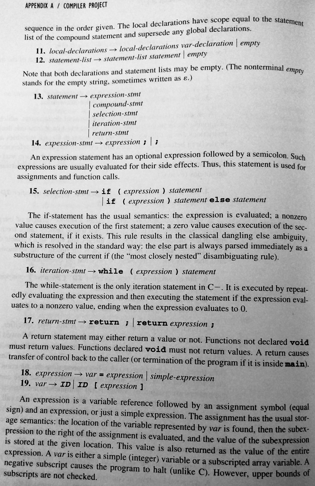
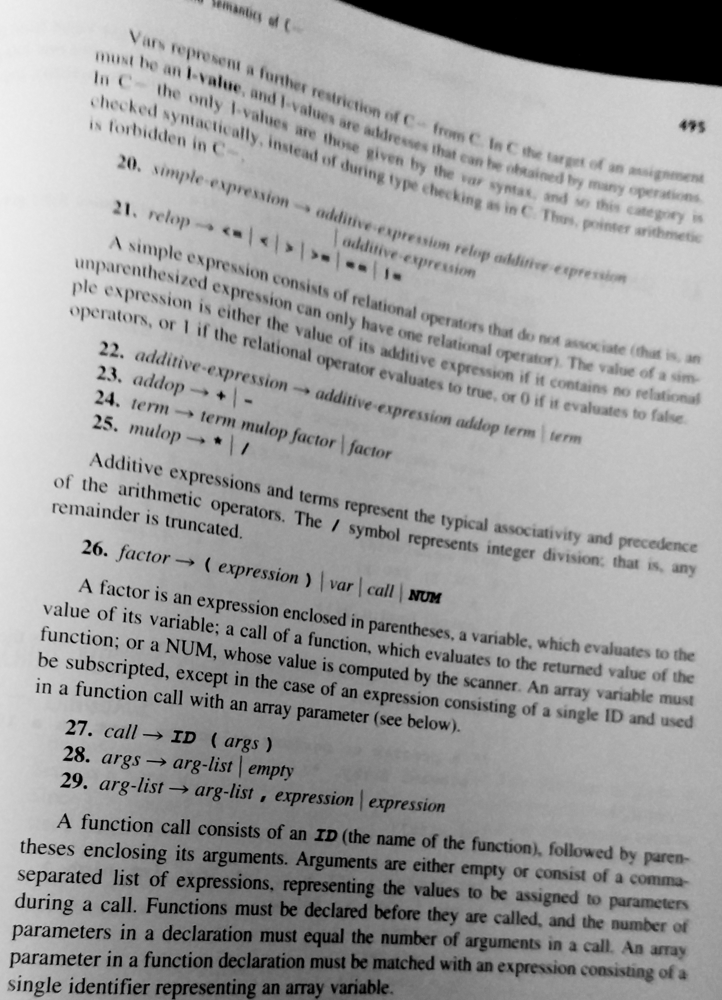

# Usage

Run the compiler using the `cminus.bat` file (or `cminus` for linux) in the 
`bin/` folder.

```
Usage: cminus [options] input_file
 `cminus` compiles the C- source language in the `input_file` into an 
 executable in the `output_file`

 If the `-o` option is not used, then the output file will have the same name 
 as the input file but with an executable extension.

 options:
  -o output_file        specifies the output executable
  -f                    overwrites the output file if it already exists
  -v                    explain what is being done verbosely
  -h, --help            show this usage guide

For example:
 # Compile prog1.cm to prog.exe (fails if prog1.exe exists)
 cminus.bat -o prog.exe prog1.cm
 # Compile prog.cm to prog.exe (fails if prog.exe exists)
 cminus.bat prog.cm
 # Compile prog1.cm to prog.exe verbosely (overwrites if prog.exe exists)
 cminus.bat -o prog.exe -v -f prog1.cm
```

# C- Language

## Examples

### Example 1

Notice that `x` and `y` are never used and that `z` is used as state for both 
functions.

```C
int x; int y;
int z[10];

void f( void ) {
    int i;
    i = 0;
    while( i < 10 ) {
        z[ i ] = 100 + 2 * i;
        i = i + 1;
    }
}

void g( void ) {
    int i;
    i = 0;
    while( i < 10 ) {
        write z[ i ];
        i = i + 1;
    }
}

void main( void ) {
    f();
    g();
}
```

Output:

```
100
102
104
106
108
110
112
114
116
118
```

### Example 2

Notice that the global variables are passed to `f` by reference.

```C
int x[5];
int y[15];
int z[10];

void f( int a[], int b[], int c[] ) {

    a[ 2 ] = 111;
    b[ 9 ] = 222;
    c[ 4 ] = 333;
}

void main( void ) {
    f(x, y, z);
    write x[ 2 ];
    write y[ 9 ];
    write z[ 4 ];

}
```

Output:

```
111
222
333
```

### Example 3

```C
void main( void ) {
    int x;
    int y;
    int z;

    read x;
    read y;
    read z;

    if( x < y ) {
        if ( x < z ) {
            if ( y < z ) {
                write x;
                write y;
                write z;
            }
            else {
                write x;
                write z;
                write y;
            }
        }
        else {
            write z;
            write x;
            write y;
        }
    }
    else {
        if( x < z ) {
            write y;
            write x;
            write z;
        }
        else {
            if( y < z ) {
                write y;
                write z;
                write x;
            }
            else {
                write z;
                write y;
                write x;
            }
        }
    }
}
```

This program reads three numbers as input and writes them back in sorted order.

Output (Ex):

```
> 200
> 100
> 300
100
200
300
```

## Example 4

Notice that the inner `if-else` statement doesn't use blocks.

```C
void main( void ) {
    int x;
    int y;

    read x;

    while( x != 1 ) {
        write x;
        y = x / 2;

        if( 2 * y == x ) 
            x = x /2;

        else
            x = 3 * x + 1;
    }
}
```

It is not clear what this program does.

Output (Ex):

```
> 20
20
10
5
16
8
4
2
```

## Example 5

Notice that this exposes some ambiguity. `write` may be a function or an 
expression surrounded by parentheses. In this case it must be an expression 
surrounded by parentheses.

```C
void f( int a[], int b[], int count ) {
    int i;
    i = 0;

    if( count < 4 ) {
        count = count + 1;
        f( a, b, count );
    }
    else {
        while( i < 5 ) {
            write( a[ i ] + b[ i ] );
            i = i + 1;
        }
    }
}

void main( void ) {
    int b[5]; int c[5];
    int i;

    i = 0;
    while( i < 5 ) {
        b[ i ] = 7 + i * 10;
        c[ i ] = i + 2;
        i = i + 1;
    }

    f( b, c, 0 );


}
```

Output:

```
9
20
31
42
53
```

## Example 6

```C
int f( int a, int b, int c, int d, int e) {
    
    write a;
    write b;
    write c;
    write d;
    write e;

    return (a + b + c + d + e);
}

void main( void ) {
    

    write f( 1, 2, 3, 4, 5);
}
```

Output:

```
1
2
3
4
5
15
```

# Compiler

## Scanner

The scanner is a finite state machine based of of the regular expressions for the tokens.



The code uses the same numbers as the diagram, but the different states are represented by an enumeration.

## Parser

The parser uses a recursive decent algorithm based on the context free grammar at the end of Compiler Construction: Principles and Practice










